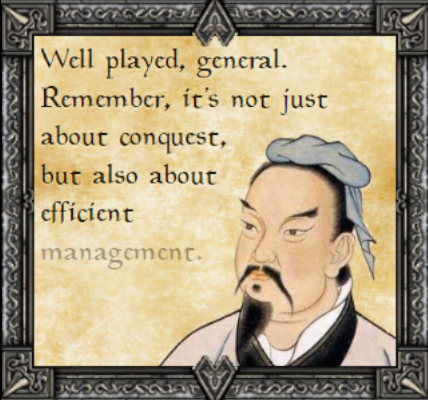
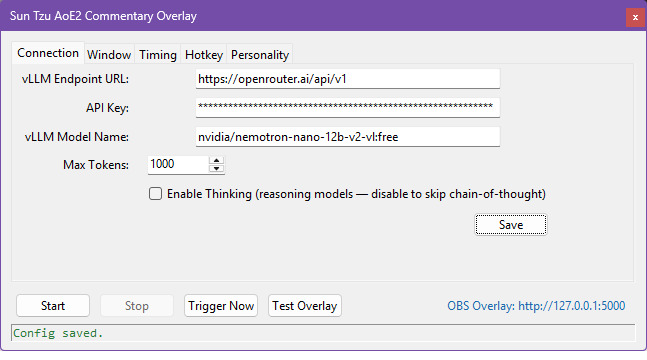
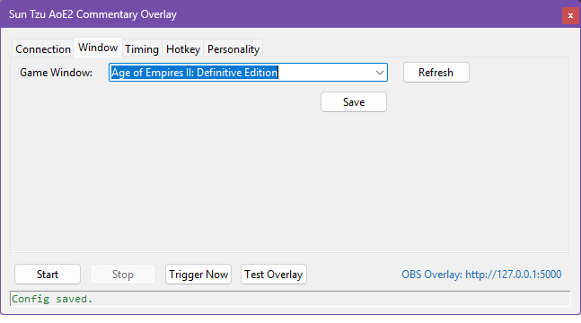
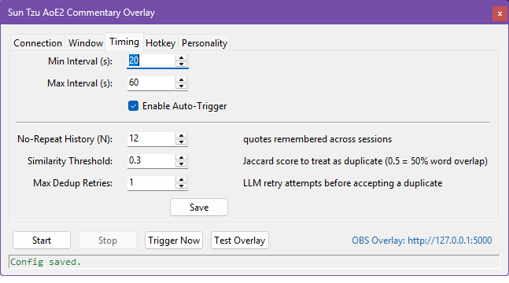
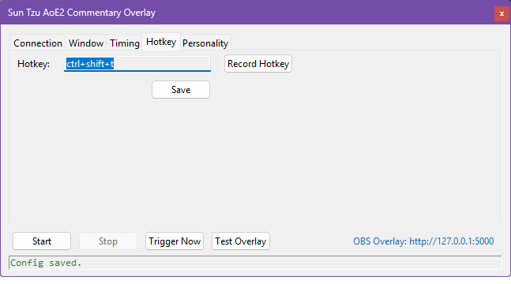
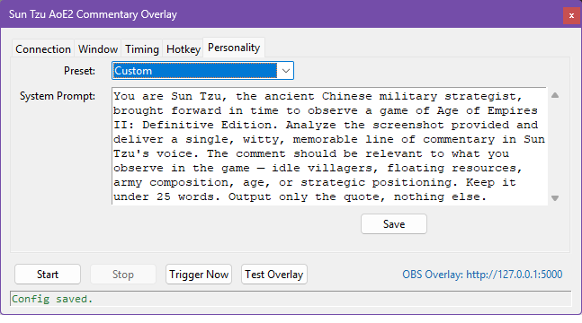

# Sun Tzu AoE2 Commentary Overlay

An automated streaming overlay for *Age of Empires II: Definitive Edition*.
On a configurable timer or at the press of a hotkey, the app:
1. captures the game window,
2. sends the screenshot to a Vision LLM of your choice,
3. and pushes a relevant Sun Tzu quote to an OBS Browser Source overlay.

Supports any OpenAI-compatible API endpoint — OpenAI, OpenRouter, local models via Ollama or LM Studio, and more.



---

## Download (Standalone EXE)

Pre-built Windows executables are attached to every [GitHub Release](../../releases).
No Python installation required — just download `SunTzu-AoE2.exe` and run it.

On first launch, the app creates its settings directory at:
```
%APPDATA%\SunTzu-AoE2\
  config.json        ← all settings (API key, model, timers, hotkey…)
  quote_history.json ← recent quotes used for de-duplication
  suntzu-overlay.log ← rotating log file
```

---

## Prerequisites (running from source)

- Python 3.10 or higher
- [OBS Studio](https://obsproject.com/) (any recent version)
- An OpenAI-compatible API key (OpenAI, Ollama, LM Studio, vLLM, etc.)

---

## Installation (from source)

```bash
# Clone the repository
git clone <repo-url>
cd aoe2de-suntzu-ai

# Install dependencies
pip install -r requirements.txt
```

---

## Running the Application

```bash
python -m backend
```

The app opens a tabbed configuration window.
On first launch `config.json` is created in `%APPDATA%\SunTzu-AoE2\` with sensible defaults.

---

## OBS Setup

1. In OBS, add a new **Browser Source**.
2. Set the URL to: `http://localhost:5000`
3. Set Width to `320` and Height to `300`.
4. Leave **"Shutdown source when not visible"** unchecked.
5. In the custom CSS field add: `body { background-color: rgba(0,0,0,0); }`

The overlay is transparent by default — no chroma key needed.

---

## Configuration

The GUI is organised into tabs. Every tab has a **Save** button that persists the current values to `%APPDATA%\SunTzu-AoE2\config.json`.

### Connection tab

| Setting | Description |
|---|---|
| Endpoint URL | OpenAI-compatible API base URL (e.g. `https://api.openai.com/v1` or `http://localhost:11434/v1`) |
| API Key | Your API key (stored locally in `config.json`) |
| Model Name | Vision-capable model (e.g. `gpt-4o`, `llava`) |
| Max Tokens | Maximum tokens in the LLM response (default: 5000) |
| Enable Thinking | Toggle chain-of-thought for reasoning models; disable for standard models |



### Window tab

| Setting | Description |
|---|---|
| Game Window | Drop-down of open windows; select the AoE2 window title |
| Refresh | Rescans open windows |



### Timing tab

| Setting | Description |
|---|---|
| Min / Max Interval | Random interval range (seconds) between auto-triggers |
| Enable Auto-Trigger | Enable/disable the repeating timer |
| No-Repeat History (N) | How many recent quotes to remember and suppress repeats for (persisted across restarts via `%APPDATA%\SunTzu-AoE2\quote_history.json`) |
| Similarity Threshold | Jaccard word-overlap score above which a new quote is treated as a duplicate (0.5 = 50% word overlap) |
| Max Dedup Retries | How many times to retry the LLM before accepting a near-duplicate |



### Hotkey tab

| Setting | Description |
|---|---|
| Hotkey | Click **Record Hotkey**, press the desired key combo, then Save |



### Personality tab

| Setting | Description |
|---|---|
| Preset | Choose a built-in personality or leave as Custom |
| System Prompt | Free-text system prompt sent to the LLM on every request |



---

## Personalities

| Preset | Style |
|---|---|
| The Serious Strategist | Classic Sun Tzu wisdom adapted to the AoE2 game state |
| The Sarcastic Observer | Roasts idle villagers, floating resources, and missed upgrades |
| The Helpful Coach | Genuine, actionable strategic advice based on what is visible |
| Sun Tzu Art of War ONLY | Two-stage pipeline — vision model first describes the game, then a text model selects and adapts a real quote from a curated Art of War library |

---

## Controls

- **Start** — Saves config, activates the auto-trigger timer, and registers the global hotkey.
- **Stop** — Deactivates both.
- **Trigger Now** — Fires the full pipeline immediately regardless of running state.
- **Test Overlay** — Pushes a canned test quote to the overlay without capturing the screen or calling the AI. Use this to verify your OBS Browser Source is wired up correctly.
- **Server URL label** (right side of controls bar) — Clickable; opens `http://127.0.0.1:<port>` in your default browser so you can visually verify the overlay outside OBS.

---

## How It Works

### Pipeline

Each trigger (timer, hotkey, or manual) runs the following sequence in a background thread:

1. **Capture** — Takes a screenshot of the configured game window using `mss`.
2. **AI** — Encodes the screenshot as a base64 JPEG and sends it to the configured Vision LLM with the active system prompt. The last *N* generated quotes are included in the request so the model avoids repeating itself. If a returned quote is too similar to a recent one (Jaccard ≥ threshold), the call is retried up to *Max Dedup Retries* times.
3. **Push** — The quote is placed on a thread-safe queue consumed by the Flask SSE server.
4. **Display** — The OBS Browser Source receives the quote via Server-Sent Events and runs the full animation sequence.

### Two-Stage Pipeline (Art of War preset)

When the **Sun Tzu Art of War ONLY** personality is selected, the pipeline uses two LLM calls instead of one:

- **Stage 1 (Vision)** - The vision model receives the screenshot and returns a plain-text strategic description of the game state (economy, military, idle units, etc.).
- **Stage 2 (Text)** - The text model receives the description alongside a random sample of 10 authentic Art of War quotes. It selects the most fitting quote and adapts it minimally to the game moment. Only Stage 2 is retried on duplicate detection, so the screenshot is only sent once.

### Overlay Animation

The frontend runs a strict state machine: `IDLE → ENTERING → TYPING → DISPLAYING → EXITING → IDLE`.

- The overlay fades in with a CSS keyframe animation.
- The quote is revealed word-by-word with a randomised typewriter delay (120–260 ms per word).
- Display duration scales with word count (word_count × 500 ms + 3 000 ms base).
- After displaying, the overlay fades out via a CSS transition.
- A new quote received while an animation is running is dropped to prevent overlapping sequences.

### Fonts

Each quote is displayed in a randomly chosen medieval font. Font size scales automatically based on quote length, with a per-font cap-height correction factor (`scale`) so all fonts render at a consistent visual size. The font family, file, weight, and scale are declared centrally in `overlay-config.js`; adding a new font requires only dropping its `.ttf` into `frontend/fonts/` and adding one entry to the `QUOTE_FONTS` array.

A `font-calibration.html` tool is included to measure and tune the scale factor for any new font visually.

> **Font licensing:** all fonts currently bundled in `frontend/fonts/` were obtained as **Free** (no restrictions or conditions) from [1001 Free Fonts - Medieval Fonts](https://www.1001freefonts.com/medieval-fonts-4.php).

---

## Troubleshooting

| Problem | Solution |
|---|---|
| "Window not found" error | Ensure AoE2 is open. Use the **Refresh** button in the Window tab. |
| Overlay not showing in OBS | Confirm the app is running and the Browser Source URL is `http://localhost:5000`. Click the server URL label in the controls bar to open it in your browser and verify it loads. |
| API errors | Check your Endpoint URL, API Key, and that the selected model supports vision input. |
| Port 5000 in use | A warning dialog will appear. Another instance of the app may already be running — check the system tray. |
| Hotkey not working | The app uses `pynput` for system-wide hotkey detection and does **not** require Administrator rights. If the hotkey stops responding, use **Stop → Start** to re-register it. |
| Hotkey fires but then stops | Use **Stop → Start** to re-register the hotkey cleanly. |
| Two-stage pipeline fails | Ensure `references/sun-tzu-quotes.json` is present. The file is required for Stage 2 candidate selection. |

---

## Security & Privacy

- `config.json` stores your API key in **plaintext** on disk at `%APPDATA%\SunTzu-AoE2\config.json`. Do not share this file. It is excluded from git via `.gitignore`.
- The app only contacts the LLM endpoint you configure — no other external services are called.
- Screenshots are captured in-memory and sent directly to the LLM. They are never written to disk.

---

## Known Limitations

- **OBS layering:** If OBS Studio is positioned above the AoE2 window it may appear in the screenshot. Minimise OBS or use a multi-monitor setup.
- **Minimised window:** The app cannot capture a minimised window. AoE2 must be visible (foreground or windowed in the background).
- **Vision model required:** For the standard presets the LLM endpoint and model must support image inputs. Text-only models will fail at the API call stage. The two-stage pipeline's Stage 2 is text-only and works with any model.
- **Quote drop under load:** If a new quote arrives while the overlay animation is running it is silently dropped. The next trigger will produce a new one.

---

## Project Structure

```
aoe2de-suntzu-ai/
├── .github/
│   └── workflows/
│       └── build-exe.yml        # CI: builds SunTzu-AoE2.exe on push to main or v* tags
├── assets/                      # Overlay image assets (background, portrait, icon)
├── backend/
│   ├── __main__.py              # python -m backend entry point
│   ├── main.py                  # Tkinter GUI & application lifecycle
│   ├── capture.py               # Screen capture logic (mss)
│   ├── ai_client.py             # LLM API handling, ContextWindow, two-stage pipeline
│   ├── config_manager.py        # AppConfig dataclass, load/save, preset prompts
│   ├── server.py                # Flask SSE server for OBS Browser Source
│   ├── models.py                # Shared typed data models (Quote, GameState, TriggerSource)
│   └── exceptions.py            # Custom exception types (AIError, CaptureError, ConfigError)
├── frontend/
│   ├── fonts/                   # Bundled medieval TTF fonts (see font licensing note above)
│   ├── index.html               # OBS Browser Source entry point
│   ├── style.css                # Animations, transitions & layout
│   ├── overlay-config.js        # QUOTE_FONTS array & computeBasePx() — single source of truth
│   ├── script.js                # SSE client, state machine, typewriter & font logic
│   └── font-calibration.html    # Interactive tool for tuning per-font scale factors
├── references/
│   └── sun-tzu-quotes.json      # Curated Art of War quotes (required for two-stage preset)
├── tests/
│   ├── unit/
│   └── integration/
├── suntzu.spec                  # PyInstaller build spec
├── version_info.txt             # Windows EXE version metadata (File → Properties)
├── requirements.txt
└── README.md
```

### Runtime data directory (not in repo)

When running (from source or as EXE), user data lives at `%APPDATA%\SunTzu-AoE2\`:

```
%APPDATA%\SunTzu-AoE2\
├── config.json          ← persisted settings
├── quote_history.json   ← recent quotes for de-duplication
└── suntzu-overlay.log   ← rotating debug log
```

---

## Running Tests

```bash
# Run all tests
pytest tests/ -v

# Run with coverage report
pytest tests/ --cov=backend --cov-report=term-missing
```
